<title>Handly — Technical Architecture (MVP v3)</title>

# Handly — Technical Architecture Document (MVP v3)

**Status:** Accepted — Milestone 1 (Foundations + Auth & Profiles) implemented & verified 2026-07-19; Milestone 2 (Requests, AI diagnosis, pricing) implemented & verified 2026-07-20
**Date:** 2026-07-18 (v3.2 — Milestone 2 completion folded in 2026-07-20)
**Sources:** `handly_mvp_v2_full_wireframe.html` (screens A–E) + founder spec additions (subscriptions, Complexity Escalation Layer, Handly Guarantee, penalties, cashback/loyalty/referrals, service tiers, admin dashboard)

> See §0.1 for the approved MVP simplifications and the tax-withholding design that this document is now the source of truth for.

---

## 0. Scope recap — what changed in v3

Handly is a **managed marketplace** for home services in Uzbekistan (plumber, electrician, cleaner, AC technician, handyman, …). Customers never browse or compare dozens of professionals; the platform auto-matches one verified master per request.

**Confirmed in v3 (previously open questions):**

- **Monetization = master subscriptions only.** No commission except a **1% tax withholding** on in-app-paid earnings. Customer AI diagnosis is free forever.
- **Customers pay in-app** (secure digital payment). Cash remains possible, but **warranty, cashback, loyalty, and referral bonuses apply only to digital in-app payments** — the incentive structure that drives digital adoption.
- **Subscription model:** permanent **Free** plan (limited leads, 5–10/month) and **Premium** (unlimited leads, priority ranking, faster job assignment, access to high-value jobs) with a **14-day free trial** for new masters. Subscription logic must be easy to change → built on a rules engine (§9.5).

**New subsystems in v3:**

| Subsystem | One-liner |
|---|---|
| Service tiers | Scheduled (free, ETA 30–60 min of slot) · Priority (small fee, ETA 15–30 min) · Emergency (higher fee, immediate dispatch, target ETA 10–15 min) |
| Complexity Escalation Layer | Dynamic trust tiers (T0–T3) × task complexity (Simple→Critical) × dynamic pricing engine — a skill economy, not a flat marketplace |
| Handly Guarantee | 30-day free rework or refund; valid only if paid in-app + verified master + qualifying service; admin-managed claims |
| Penalty engine | Automated sanctions for cancellations, no-shows, poor ratings, low response rate (masters) and no-shows, fraud, abuse (customers) |
| Incentives | 1–3% cashback as frozen in-app credits, digital-payment discounts, loyalty rewards, referral bonuses (credited after referee's first digital payment) |
| Admin dashboard | Full back office: verification, users, categories, requests, payments, refunds, warranties, penalties, subscriptions, analytics, support, platform settings |

**Spec tension resolved (please confirm):** "match on rating/response/AI confidence" vs "select randomly the closest master." Design: **sequential auto-dispatch** — filter eligible masters, score them, then make a *weighted-random pick among the top-N closest*, offering to **one master at a time** with a short acceptance window and cascading on decline/timeout. This keeps quality signals, adds fairness/anti-gaming randomness, and never shows customers a list.

Assumptions carried from v2: mobile-first **PWA**; Uzbek + Russian i18n; wireframe needs minor v3 additions (service-tier selector replaces the lone "urgent" option; Free plan replaces Basic on screen D; warranty-claim and referral screens).

---

## 0.1 Approved MVP build decisions (2026-07-19)

Founder-approved scope reductions for the initial build. Each is a *config/adapter* choice behind an interface, so expanding later is additive, not a rewrite.

| Area | MVP decision | Full design (later) |
|---|---|---|
| App architecture | **NestJS API + Next.js web** in a pnpm/Turborepo monorepo | unchanged |
| Payments | **One provider first (Click _or_ Payme)** behind the payment abstraction | add the remaining Payme/Click/Uzum adapters |
| Payouts | **Manual admin payouts** | automated payout API |
| Master verification | **Manual admin review** (MyID behind `VerificationProvider` interface) | MyID + liveness integration |
| SMS | **Eskiz only** (mock provider in dev) | Play Mobile fallback |
| Geography | **One district/city** | multi-city (already data-scoped) |
| AI | **Claude only** | unchanged |
| Free-plan leads | **10 accepted jobs / month** | rule-config tunable |
| Cashback | **1%** initially | 1–3% loyalty schedule |
| Warranty funding | **Platform pays first, then recovers from the at-fault master** | unchanged |
| Final price | **May not exceed the estimated range without explicit in-app customer approval** | unchanged |
| Dev database | **Docker Compose** (Postgres + Redis) | in-country managed Postgres (residency) |

### Tax withholding (1%) — design

The **1% is a tax withholding, not Handly's commission.** If a master is registered as self-employed (*o'zini o'zi band qilgan*), the platform may be required to withhold and remit a small tax on in-app payments. **The exact legal obligation (whether Handly is the withholding agent, and the remittance cadence) must be confirmed with a local tax adviser before wiring this into settlement (Milestone 4).**

Data model & interface (interface + mock built in M1; wired at settlement in M4):

- Store each master's **PINFL (JShShIR)** encrypted at rest (AES-256-GCM; `master_profiles.pinflEncrypted`).
- Mark whether the master **is self-employed** (`master_profiles.isSelfEmployed`).
- A **`TaxProvider` interface** with `computeWithholding()` + `recordWithholding()`.
  - `MockTaxProvider` (MVP) — computes the configured rate, records to log/DB.
  - `SoliqTaxProvider` (later) — real Soliq.uz API: remit accumulated 1% to the State Tax Committee, generate tax receipts/history for masters.
- Selected by `TAX_PROVIDER` env, so swapping mock → real touches nothing else:

```
TaxProvider (interface)
    ├── MockTaxProvider   (MVP)
    └── SoliqTaxProvider  (real API, post-launch)
```

- Record the 1% withheld per eligible payment as a `TAX_WITHHOLD` ledger entry (§10) alongside the master's `ORDER_EARNING`.

---

## 1. Recommended tech stack

| Layer | Choice | Justification |
|---|---|---|
| Language | **TypeScript everywhere** | One language across web/API/workers; shared validation contracts; best hiring pool for a small Tashkent team. |
| Frontend | **Next.js 15 (App Router), Tailwind, PWA** | Mobile-first PWA matches phone-shaped wireframes; installable on Android (dominant in UZ) without app-store friction; admin dashboard is a route group in the same app. |
| Backend | **NestJS (Fastify)** — modular monolith | Enforced module boundaries give microservice-shaped seams without the ops cost; guards/interceptors map cleanly to the layered authorization (§6) and capability gates. |
| Database | **PostgreSQL 16 + PostGIS** | One store for relational core, geo matching, JSONB rule configs and AI payloads, and a serializable money ledger. |
| ORM | **Prisma** (raw SQL escape hatch for PostGIS) | Type-safe migrations; geo queries stay hand-written and indexed. |
| Cache / queues | **Redis + BullMQ** | Dispatch cascades, offer-expiry timers, SMS/push senders, penalty & tier recomputation, subscription renewal/trial expiry, AI jobs, reconciliation. |
| Realtime | **Socket.IO (Redis adapter)** + **FCM/Web Push** | Offers must reach masters in seconds (Emergency window is 60 s); live order tracking for customers. |
| Storage | **S3-compatible (MinIO → any S3)** | Order photos/videos, portfolios, certification scans; presigned uploads. |
| SMS | **Eskiz.uz** (fallback Play Mobile), behind `SmsProvider` | De-facto UZ gateways. |
| Maps/geo | **Yandex Maps JS + Geocoder**; navigation deep-links to Yandex/Google apps | Best UZ coverage; no routing to build. |
| Identity | **MyID placeholder** behind `VerificationProvider` + manual admin review fallback; Didox later | B2B contract timelines must never block launch. |
| Payments | **Payme / Click / Uzum** behind one abstraction (§10) | As specified. |
| AI | **Claude API (`claude-sonnet-5`)** — vision + structured outputs (§8) | Photo/video diagnosis, complexity classification, moderation; no ML team required. |
| Infra | **Docker Compose on Tashkent-region VPS**, Caddy, GitHub Actions | UZ data-residency law requires in-country storage of citizens' personal data (§12.1); Compose is sufficient far past MVP. |
| Observability | Sentry + Grafana/Loki/Prometheus | Cheap, self-hostable. |

Rejected deliberately: microservices (team too small), MongoDB (money/geo/integrity want Postgres), Firebase (residency + lock-in), separate native codebases (PWA first, Capacitor wrap later).

---

## 2. System architecture

```mermaid
flowchart TB
  subgraph Clients
    CW[Customer PWA]
    MW[Master PWA]
    AD[Admin dashboard]
  end

  subgraph Edge
    CDN[CDN static]
    PX[Caddy TLS proxy]
  end

  subgraph App["NestJS modular monolith"]
    AUTH[auth]
    USR[users and profiles]
    CAT[catalog]
    ORD[orders]
    DSP[dispatch and matching]
    PRC[pricing engine]
    TRS[trust and penalties]
    WTY[warranty]
    SUB[subscriptions]
    PAY[payments]
    WAL[wallets and incentives]
    NTF[notifications]
    AIM[ai diagnosis]
    RUL[rules engine]
    ADM[admin]
    GW[socket gateway]
  end

  subgraph Workers["BullMQ workers"]
    W1[dispatch cascade and offer expiry]
    W2[sms and push sender]
    W3[payment reconciliation]
    W4[subscription renewal and trial expiry]
    W5[ai jobs and moderation]
    W6[tier and penalty recompute]
    W7[cashback and referral settlement]
  end

  subgraph Data
    PG[(PostgreSQL + PostGIS)]
    RD[(Redis)]
    S3[(S3 storage)]
  end

  subgraph External
    ESK[Eskiz SMS]
    MYID[MyID]
    PP[Payme]
    CK[Click]
    UZM[Uzum]
    FCM[FCM push]
    CLA[Claude API]
    YMAP[Yandex Maps]
  end

  CW --> PX
  MW --> PX
  AD --> PX
  CW --> CDN
  PX --> App
  App --> PG
  App --> RD
  App --> S3
  Workers --> PG
  Workers --> RD
  GW <--> RD
  W2 --> ESK
  W2 --> FCM
  W5 --> CLA
  AUTH --> MYID
  PAY <--> PP
  PAY <--> CK
  PAY <--> UZM
  CW --> YMAP
```



**Order lifecycle (happy path):** create request (description + media + GPS + tier/slot) → AI diagnosis enriches (issue, category, complexity, confidence) → pricing engine returns estimated range → customer confirms (Priority/Emergency platform fee charged at booking) → dispatch cascade assigns one master → live status (`ASSIGNED → EN_ROUTE → IN_PROGRESS → COMPLETED`) → customer confirms completion → final price (within band) paid in-app → master wallet credited minus 1% tax → cashback/loyalty/referral settlement → review → 30-day warranty window opens.

Every money- or trust-relevant transition emits a **domain event** (`order.completed`, `payment.paid`, `dispatch.no_show`…) consumed by wallet, trust, incentive, and notification modules — modules stay decoupled and the economy stays auditable.

---

## 3. Database schema (ERD)

Two diagrams for readability: marketplace core, then economy & trust. All money is integer so'm (tiyin), no floats.

### 3.1 Marketplace core

```mermaid
erDiagram
  USERS ||--o| CUSTOMER_PROFILES : has
  USERS ||--o| MASTER_PROFILES : has
  USERS ||--o{ ADDRESSES : saves
  USERS ||--o{ SESSIONS : opens
  USERS ||--o{ DEVICES : registers
  USERS ||--o{ NOTIFICATIONS : receives
  MASTER_PROFILES ||--o{ MASTER_SKILLS : declares
  MASTER_PROFILES ||--o{ MASTER_MEDIA : shows
  MASTER_PROFILES ||--o{ SERVICE_AREAS : covers
  MASTER_PROFILES ||--o{ AVAILABILITY_SLOTS : keeps
  MASTER_PROFILES ||--o{ VERIFICATIONS : undergoes
  SERVICE_CATEGORIES ||--o{ MASTER_SKILLS : includes
  USERS ||--o{ ORDERS : places
  SERVICE_CATEGORIES ||--o{ ORDERS : classifies
  ORDERS ||--o{ ORDER_MEDIA : attaches
  ORDERS ||--o| AI_DIAGNOSES : enriched_by
  ORDERS ||--o{ ORDER_STATUS_HISTORY : logs
  ORDERS ||--o{ ORDER_DISPATCHES : offers
  MASTER_PROFILES ||--o{ ORDER_DISPATCHES : considers
  ORDERS ||--o| REVIEWS : gets

  USERS {
    uuid id PK
    text phone UK
    text password_hash
    enum role "CUSTOMER MASTER ADMIN"
    enum status "PENDING ACTIVE SUSPENDED BANNED"
    text referral_code UK
    text locale
    timestamptz created_at
  }
  MASTER_PROFILES {
    uuid user_id PK
    text full_name
    smallint experience_years
    text bio
    enum verification_status "UNVERIFIED PENDING VERIFIED REJECTED"
    smallint trust_tier "0..3 cached"
    numeric rating_avg "cached"
    int jobs_done "cached"
    geography last_location
  }
  MASTER_MEDIA {
    uuid id PK
    uuid master_id FK
    enum kind "CERTIFICATION PORTFOLIO"
    text object_key
    text caption
    bool admin_approved
  }
  SERVICE_AREAS {
    uuid id PK
    uuid master_id FK
    geography zone "polygon or point plus radius"
  }
  SERVICE_CATEGORIES {
    uuid id PK
    text slug UK
    text name_uz
    text name_ru
    int base_price_min
    int base_price_max
    bool warranty_eligible
    bool active
  }
  ORDERS {
    uuid id PK
    bigint order_no UK
    uuid customer_id FK
    uuid category_id FK
    uuid master_id FK "null until assigned"
    text description
    geography location "snapshot"
    text address_text "snapshot"
    enum service_tier "SCHEDULED PRIORITY EMERGENCY"
    enum complexity "SIMPLE MEDIUM COMPLEX CRITICAL"
    enum status
    timestamptz scheduled_at
    int platform_fee "priority or emergency fee"
    int price_min
    int price_max
    int final_price
    enum payment_channel "IN_APP CASH null"
    int credits_applied "cashback spent"
    timestamptz completed_at
    timestamptz warranty_until "completed_at + 30d if eligible"
    timestamptz created_at
  }
  AI_DIAGNOSES {
    uuid order_id PK
    text probable_issue
    uuid suggested_category_id
    enum suggested_complexity
    numeric confidence
    jsonb raw_output
    text prompt_version
  }
  ORDER_DISPATCHES {
    uuid id PK
    uuid order_id FK
    uuid master_id FK
    int rank_in_cascade
    int distance_m
    numeric score
    bool counted_as_lead
    enum status "OFFERED ACCEPTED DECLINED EXPIRED WITHDRAWN"
    timestamptz offered_at
    timestamptz expires_at
    timestamptz responded_at
  }
  ORDER_STATUS_HISTORY {
    uuid id PK
    uuid order_id FK
    enum from_status
    enum to_status
    uuid actor_id
    timestamptz created_at
  }
  REVIEWS {
    uuid id PK
    uuid order_id FK UK
    uuid author_id FK
    uuid target_id FK
    smallint rating
    text comment
    bool moderated_ok
  }
```

### 3.2 Economy & trust

```mermaid
erDiagram
  MASTER_PROFILES ||--|| MASTER_STATS : measured_by
  MASTER_PROFILES ||--o{ SUBSCRIPTIONS : holds
  PLANS ||--o{ SUBSCRIPTIONS : defines
  USERS ||--o{ WALLETS : owns
  WALLETS ||--o{ WALLET_ENTRIES : records
  MASTER_PROFILES ||--o{ PAYOUTS : requests
  USERS ||--o{ PAYMENTS : makes
  USERS ||--o{ PENALTY_EVENTS : incurs
  ORDERS ||--o{ PENALTY_EVENTS : sources
  ORDERS ||--o| WARRANTY_CLAIMS : may_open
  USERS ||--o{ REFERRALS : refers
  USERS ||--o{ PAYMENT_CARDS : links

  MASTER_STATS {
    uuid master_id PK
    int completed_jobs
    int cancels_90d
    int no_shows_90d
    numeric response_rate
    int avg_response_ms
    numeric rating_avg
    int penalty_points_active
    timestamptz recomputed_at
  }
  PLANS {
    uuid id PK
    text code UK "FREE PREMIUM"
    int price "0 for FREE"
    int leads_per_month "null = unlimited"
    int trial_days "14 on PREMIUM"
    jsonb features "priority_boost offer_head_start high_value_access"
    bool active
  }
  SUBSCRIPTIONS {
    uuid id PK
    uuid master_id FK
    uuid plan_id FK
    enum status "TRIAL ACTIVE PAST_DUE EXPIRED CANCELLED"
    timestamptz trial_ends_at
    timestamptz starts_at
    timestamptz expires_at
    bool auto_renew
  }
  WALLETS {
    uuid id PK
    uuid user_id FK
    enum kind "EARNINGS CREDITS"
    bigint balance_cached
  }
  WALLET_ENTRIES {
    uuid id PK
    uuid wallet_id FK
    enum direction "CREDIT DEBIT"
    bigint amount
    enum ref_type "ORDER_EARNING TAX_WITHHOLD PAYOUT CASHBACK REFERRAL_BONUS LOYALTY_REWARD ORDER_SPEND REFUND ADJUSTMENT"
    uuid ref_id
    bigint balance_after
    timestamptz created_at
  }
  PAYMENTS {
    uuid id PK
    uuid user_id FK
    enum provider "PAYME CLICK UZUM"
    text provider_txn_id
    int amount
    enum purpose "ORDER PLATFORM_FEE SUBSCRIPTION"
    uuid ref_id
    enum status "CREATED PENDING PAID FAILED CANCELLED REFUNDED"
    text idempotency_key UK
    jsonb provider_payload
    timestamptz created_at
  }
  PAYOUTS {
    uuid id PK
    uuid master_id FK
    uuid card_id FK
    bigint amount
    enum status "REQUESTED PROCESSING PAID FAILED"
    text provider_ref
  }
  PAYMENT_CARDS {
    uuid id PK
    uuid user_id FK
    enum provider
    text provider_token "PSP token never PAN"
    text masked_pan
    bool is_default
  }
  PENALTY_EVENTS {
    uuid id PK
    uuid user_id FK
    uuid order_id FK
    enum type "CANCEL_AFTER_ACCEPT NO_SHOW LOW_RATING LOW_RESPONSE CUSTOMER_NO_SHOW FRAUD_CLAIM ABUSE"
    int points
    enum applied_sanction "NONE WARNING DEMOTION SUSPENSION_7D BAN"
    text note
    uuid decided_by "null = automatic"
    timestamptz expires_at "points decay"
    timestamptz created_at
  }
  WARRANTY_CLAIMS {
    uuid id PK
    uuid order_id FK UK
    uuid customer_id FK
    text reason
    jsonb media_keys
    enum status "SUBMITTED REVIEWING APPROVED_REWORK APPROVED_REFUND REJECTED CLOSED"
    uuid rework_order_id FK "linked zero-price order"
    uuid resolved_by
    timestamptz created_at
    timestamptz resolved_at
  }
  REFERRALS {
    uuid id PK
    uuid referrer_id FK
    uuid referee_id FK UK
    enum status "PENDING QUALIFIED CREDITED"
    uuid qualifying_payment_id
    timestamptz credited_at
  }
  RULE_CONFIGS {
    uuid id PK
    text key "tier_thresholds pricing penalty cashback dispatch plans"
    int version
    jsonb payload
    timestamptz active_from
    uuid updated_by
  }
```

**Normalization & integrity notes**

- 3NF with **documented denormalizations only**: order address/price snapshots (historical correctness), `master_profiles.trust_tier/rating_avg/jobs_done` and `MASTER_STATS` (read-heavy dispatch scoring; recomputed by worker W6), `wallets.balance_cached` (derived from append-only `wallet_entries`, reconciled nightly).
- **Two wallet kinds:** masters hold `EARNINGS` (withdrawable); customers hold `CREDITS` (cashback/referral/loyalty — **frozen in-app, spendable only on Handly orders, never withdrawable**). Same ledger mechanics, different capability rules.
- **1% tax:** on order payment success the ledger posts `ORDER_EARNING +final_price` and `TAX_WITHHOLD −1%` atomically; withheld tax accumulates in a platform system account for remittance. Commission-free otherwise, but the `ref_type` enum makes adding commission later a config change, not a schema change.
- **Order state machine** (service-layer enforced + history table): `DRAFT → PRICED → SEARCHING → ASSIGNED → EN_ROUTE → IN_PROGRESS → COMPLETED → PAID → CLOSED`, branches: `CANCELLED_BY_CUSTOMER`, `CANCELLED_BY_MASTER` (→ back to `SEARCHING` + penalty event), `NO_SHOW`, `EXPIRED`, `DISPUTED`, `WARRANTY_REWORK`.
- Indexes: GIST on all geography; partial index on active orders; unique `(order_id, master_id)` dispatches; **partial unique index: one non-expired subscription per master**; `wallet_entries` append-only (no UPDATE grant).

---

## 4. Folder structure (monorepo — pnpm workspaces + Turborepo)

```
handly/
├── apps/
│   ├── web/                      # Next.js PWA
│   │   ├── app/
│   │   │   ├── (auth)/           # login, register, otp
│   │   │   ├── (customer)/       # home, request wizard, tracking, wallet-credits,
│   │   │   │                     #   warranty claims, referrals, history, profile
│   │   │   ├── (master)/         # onboarding, offers, jobs, earnings wallet,
│   │   │   │                     #   subscription, stats, portfolio, availability
│   │   │   └── admin/            # verification queue, users, orders, warranties,
│   │   │                         #   penalties, payments, rules, analytics
│   │   ├── components/           # ui/ primitives, features/ domain
│   │   ├── lib/                  # api client, socket client, i18n
│   │   ├── stores/               # Zustand
│   │   └── public/               # manifest, sw, icons
│   └── api/                      # NestJS
│       ├── src/
│       │   ├── modules/
│       │   │   ├── auth/  users/  catalog/  orders/
│       │   │   ├── dispatch/     # matching, cascade, offers, gateway
│       │   │   ├── pricing/      # dynamic pricing engine
│       │   │   ├── trust/        # tiers, stats, penalty engine
│       │   │   ├── warranty/
│       │   │   ├── subscriptions/
│       │   │   ├── payments/     # abstraction + payme/click/uzum adapters
│       │   │   ├── wallets/      # ledger, payouts, incentives (cashback/referral/loyalty)
│       │   │   ├── notifications/
│       │   │   ├── ai/           # diagnosis, moderation
│       │   │   ├── rules/        # rule_configs load/validate/hot-reload
│       │   │   └── admin/
│       │   ├── common/           # guards, filters, pipes, decorators
│       │   ├── infra/            # prisma, redis, s3, config
│       │   └── workers/          # BullMQ processors (W1–W7)
│       └── test/
├── packages/
│   ├── contracts/                # zod schemas + types shared web/api
│   ├── ui/                       # design tokens from wireframe
│   └── config/                   # eslint, tsconfig presets
├── infra/                        # docker compose, Caddyfile, backup scripts
└── docs/                         # this document, ADRs
```

Rule: **modules own their tables**; cross-module access only through the owning module's service or domain events — keeps future service extraction cheap.

---

## 5. API endpoint design (REST, `/api/v1`, JSON, JWT bearer)

Conventions: plural nouns; state transitions as intent-named POST sub-resources; cursor pagination; RFC 9457 errors; `Idempotency-Key` on all mutations.

**Auth** (unchanged from v2)
```
POST /auth/register · /auth/otp/verify · /auth/otp/request · /auth/login
POST /auth/refresh · /auth/logout · /auth/password/reset
```

**Catalog & AI diagnosis**
```
GET  /categories
POST /diagnoses                    # {description, media_keys} → issue, category,
                                   #   complexity, confidence, price range (free, rate-limited)
```

**Customer requests**
```
POST /orders                       # draft: description, media, location, tier, slot
POST /orders/{id}/media            # presigned upload init
GET  /orders/{id}/quote            # pricing engine → estimated range + fees
POST /orders/{id}/submit           # PRICED → SEARCHING (charges Priority/Emergency fee)
GET  /orders?role=&status=  ·  GET /orders/{id}       # incl. live status, assigned master
POST /orders/{id}/cancel  ·  POST /orders/{id}/confirm-completion
POST /orders/{id}/pay              # in-app payment (credits_applied optional)
POST /orders/{id}/review
GET  /orders/{id}/contact          # masked proxy number while active
POST /warranty-claims  ·  GET /warranty-claims?mine
```

**Master side**
```
GET  /dispatches?status=offered
POST /dispatches/{id}/accept       # first valid accept wins (409 if expired/lost)
POST /dispatches/{id}/decline
POST /orders/{id}/status           # EN_ROUTE → IN_PROGRESS → COMPLETED (+final_price)
GET|PATCH /masters/me              # profile, skills, certifications, portfolio, areas
POST /masters/me/verification
GET|PUT /masters/me/availability
GET  /masters/me/stats             # performance, tier, progress to next tier, penalties
```

**Subscriptions, wallets, incentives**
```
GET  /plans  ·  GET /subscriptions/me
POST /subscriptions                # start trial or purchase Premium
POST /subscriptions/me/cancel
GET  /wallets  ·  GET /wallets/{kind}/entries
POST /wallets/earnings/payouts  ·  GET /wallets/earnings/payouts
GET  /referrals/me                 # code, invitees, statuses
GET|POST|DELETE /cards             # PSP-tokenized only
POST /payments  ·  GET /payments/{id}
```

**Admin** (`/admin`, ADMIN role + 2FA)
```
GET|POST /admin/verifications/{id}/approve|reject
GET|PATCH /admin/users · /admin/orders · /admin/categories · /admin/plans
GET|POST /admin/warranty-claims/{id}/resolve
GET|POST /admin/penalties · /admin/penalties/{id}/override
GET  /admin/payments · POST /admin/payments/{id}/refund
GET|PUT /admin/rules/{key}         # versioned rule configs (§9.5)
GET  /admin/analytics/overview     # metrics feed for dashboards
```

**Webhooks** (signature-verified, IP-allowlisted, no JWT)
```
POST /webhooks/payme  ·  /webhooks/click/prepare  ·  /webhooks/click/complete
POST /webhooks/uzum  ·  /webhooks/myid
```

Realtime: `master:{id}` → `dispatch.offered/expired`; `customer:{id}` → `order.assigned/status_changed/eta_updated`; both → `notification.new`.

---

## 6. Authentication & authorization

**Authentication** (unchanged from v2): phone + password with mandatory SMS OTP at signup (Eskiz, hashed codes, 3-min TTL, resend cooldown 45 s); Argon2id; access JWT 15 min + rotating single-use refresh 30 d in httpOnly cookies; per-phone/IP/device OTP rate limits and daily SMS caps (anti SMS-pumping); sessions revocable per device.

**Authorization — three independent role systems, layered:**

1. **RBAC:** `CUSTOMER | MASTER | ADMIN` guards on every route group; admin additionally requires TOTP 2FA + IP allowlist.
2. **Capability gates (policy guards, per request):**
   - Master can receive/accept dispatches only if: `verification_status = VERIFIED` ∧ subscription in `{TRIAL, ACTIVE}` ∧ (plan unlimited ∨ monthly lead quota remaining) ∧ no active suspension sanction.
   - **Trust-tier gate:** order complexity/value class must be ≤ master's tier access (T0→Simple … T3→Critical/high-value) — §9.1.
   - Warranty claim endpoint checks: order `payment_channel = IN_APP` ∧ master verified ∧ category `warranty_eligible` ∧ within `warranty_until`.
3. **Ownership:** customers see only their orders; masters only orders dispatched to them; masked-contact valid only while an order is active between the two parties.

---

## 7. State management (frontend)

- **Server state → TanStack Query**; socket events invalidate queries rather than carry truth (missed messages self-heal on refetch). Live tracking subscribes to `order.status_changed`/`eta_updated` and refetches the order.
- **Client state → Zustand:** session; **request wizard** (description → media → AI diagnosis result → location → tier/slot → quote) persisted to `sessionStorage`; UI state.
- **Forms:** react-hook-form + zod resolvers from `packages/contracts` — the same schemas the API validates.
- **Optimistic updates** only where loss is harmless (notification read, decline offer). Accepting an offer and paying are never optimistic — wait for 200/409.
- Offer countdowns render from server-sent `expires_at`; admin dashboard uses the same query layer with longer cache times and table-oriented components.

---

## 8. AI service architecture — free AI diagnosis

Stance unchanged: **AI assists, never gates.** Every feature has a deterministic fallback; the flow works fully if the AI module is down. Free for customers by design — its job is matching accuracy, first-time-fix rate, and efficiency, not revenue.

```
modules/ai/
├── ai.service.ts        # Claude client (claude-sonnet-5), retries, timeouts, cost caps
├── diagnosis.ts         # media + text → issue, category, complexity, confidence
├── moderation.ts        # photos, reviews, portfolios → allow | flag_for_admin
└── prompts/             # versioned templates (uz/ru)
```

| Output | Consumed by | Mode | Fallback if AI unavailable |
|---|---|---|---|
| Probable issue + clean summary | Customer confirmation UI, master job card | Sync, 2.5 s timeout | Raw description shown |
| Suggested category | Wizard (chip, user can override) | Sync | User's manual pick |
| **Complexity class** (Simple/Medium/Complex/Critical) | Pricing engine + tier gate (§9) | Sync | Category default complexity |
| Confidence score | Dispatch scoring (`ai_match` term) | Sync | Neutral weight |
| Price range input | Pricing engine (one input among several — never the final number) | Sync | Category base band |
| Media/review moderation | Admin flag queue | Async (W5) | Publish now, flag retroactively |

Rules: structured outputs (JSON schema, low temperature); **video handled as sampled key-frames** for MVP (vision on frames — cheaper and simpler than video understanding); prompts versioned in-repo; every call logged to `AI_DIAGNOSES`/`ai_logs` (input hash, prompt version, output, latency, cost) for auditability and offline evaluation; per-user daily budget caps; PII (names, phones) stripped before any API call. Claude is a foreign-hosted processor → disclosed in the privacy policy (§12.1).

---

## 9. Marketplace engine — matching, escalation, penalties, warranty, incentives

The heart of v3. All parameters live in the **rules engine (§9.5)** so product can tune the economy without deploys.

### 9.1 Complexity Escalation Layer

**A) Trust tiering (dynamic, recomputed by worker W6 on completion/review events + nightly):**

| Tier | Default criteria (rule-config) | Access |
|---|---|---|
| T0 | New / just verified | Simple, low-value orders only |
| T1 | ≥5 completed, rating ≥4.0 | + Medium |
| T2 | ≥20 completed, rating ≥4.5, cancel rate <5% | + Complex, premium-value orders |
| T3 | ≥50 completed, rating ≥4.8, response <2 min, zero recent penalties | + Critical / Emergency / highest-value; unlocks premium personal rate band |

Tiers can move **down** (penalties, rating decay) — a level, not a badge. Customers also carry a lightweight trust score (no-shows, fraud flags) used by the penalty engine and to require prepayment from low-trust customers (post-MVP option). Purpose: blocks scammers, low-quality spam, and price dumping.

**B) Task complexity classification:** every order auto-labeled `SIMPLE | MEDIUM | COMPLEX | CRITICAL` by AI diagnosis (fallback: category default; admin can relabel). Drives price-band width (fixed-ish → wide + negotiation), tier eligibility, and surge behavior for Critical.

**C) Dynamic pricing engine (`modules/pricing`)** — deterministic, versioned, testable; AI supplies inputs, never the output:

```
range = category_base_band
      × complexity_multiplier(complexity)          # e.g. 1.0 / 1.4 / 2.2 / 3.0+
      × tier_factor(service_tier)                  # scheduled 1.0; priority/emergency add platform_fee + surge
      × demand_factor(zone)                        # open orders vs available masters, capped e.g. 0.9–1.5
      × master_band(trust_tier)                    # T3 unlocks higher personal rates (post-MVP)
```

Output is always a **range, never a fixed price**; final price is set at completion within the band (overage requires explicit customer approval in-app). Every quote stores its rule version → reproducible and A/B-testable.

### 9.2 Matching & dispatch (managed marketplace)

Customers never see a list of professionals. On `submit`:

1. **Eligibility filter (SQL + PostGIS):** category skill ∧ service area covers order location ∧ available at slot/now ∧ verified ∧ subscription valid with lead quota ∧ trust tier ≥ complexity requirement ∧ not suspended.
2. **Score** = weighted(distance, rating, response rate/speed, completed jobs, AI-diagnosis match confidence) + Premium priority boost. Weights in rule-config.
3. **Selection:** *weighted-random pick among the top-N (default 5) closest* eligible masters — implements "select randomly the closest master" while keeping quality signals and preventing one master from monopolizing a zone.
4. **Sequential offers, one master at a time** (no bidding): acceptance windows — Emergency 60 s, Priority 120 s, Scheduled 10 min. Decline/timeout → cascade to next candidate (W1). **Premium head start:** first cascade round draws from Premium masters only ("faster job assignment"); Free masters enter from round two.
5. Pool exhausted → radius expands stepwise → still empty → customer notified with option to convert tier/reschedule; admin alerted. ETA targets (10–15 / 15–30 / 30–60 min) are monitored as SLOs per tier (§ analytics).
6. **Leads:** a dispatch marks `counted_as_lead = true` per rule-config — **default: counted on `ACCEPTED`** (Free masters aren't punished for declining; quota = jobs taken/month, default 10). Alternative (count on offer) is a config flip. Premium/trial: unlimited.
7. Race safety: accept runs `SELECT … FOR UPDATE SKIP LOCKED` on the order row; only one `ACCEPTED` dispatch can exist.

### 9.3 Penalty engine (automated quality control)

Event-driven points with 90-day decay, thresholds in rule-config, sanctions auto-applied by W6, admin can override/appeal (audit-logged):

| Actor | Signal | Default effect |
|---|---|---|
| Master | Cancel after accept | +2 pts |
| Master | No-show (customer-reported, admin-confirmable) | +4 pts |
| Master | Rating ≤2 (each) / rolling avg <4.0 | +2 pts / demotion review |
| Master | Response rate <50% over 20 offers | +2 pts |
| Customer | No-show at scheduled time | +3 pts |
| Customer | Fraudulent warranty claim (admin-marked) | +5 pts |
| Customer | Abuse (reports/moderation) | +3 pts |

Sanction ladder: `WARNING → DEMOTION (score/tier penalty) → SUSPENSION_7D → BAN`. Sanctions feed straight back into dispatch eligibility (§9.2.1) and trust tiers (§9.1).

### 9.4 Handly Guarantee (warranty) & incentives

**Warranty:** eligibility auto-checked at claim time (in-app payment ∧ verified master ∧ `category.warranty_eligible` ∧ within 30 days of completion). Flow: `SUBMITTED → REVIEWING → APPROVED_REWORK | APPROVED_REFUND | REJECTED`, all managed in the admin dashboard with SLA timers. **Rework** creates a linked zero-price order (dispatched to the original master first; his cost, since at-fault — else another master, platform-funded). **Refund** goes via PSP refund or credits. At-fault master clawback = wallet debit by admin decision. Warranty terms surface in the app as the strongest reason to pay digitally.

**Incentives (all only on digital in-app payments, settled by W7 after `payment.PAID`):**
- **Cashback 1–3%** of order value → customer `CREDITS` wallet (frozen: spendable only at Handly checkout via `credits_applied`, never withdrawable). Rate schedule in rule-config (e.g., base 1%, 2% after 5 digital orders, 3% after 15 — loyalty rewards).
- **Referral:** every user has a `referral_code`; bonus credited to **both** sides only after the referee's **first digital payment** (`REFERRALS.status: PENDING → QUALIFIED → CREDITED`) — fraud-resistant by construction.
- **Digital-payment discounts:** promo rules in rule-config applied at quote time, displayed as "pay in-app and save."

### 9.5 Rules engine — "modifiable without redeploys"

All economy parameters — plan definitions & quotas, trial length, tier thresholds, pricing multipliers & surge caps, dispatch weights & windows & N, penalty points & ladders, cashback/referral rates — live in **`RULE_CONFIGS`** (versioned JSONB, zod-validated on write, hot-reloaded via Redis pub/sub, editable in admin). Code consumes typed rule objects; changing the subscription model in a future version is a config edit + migration of the `plans` rows, not a rewrite. Every consumer records the rule version it used (quotes, penalties, cashback) → full auditability.

---

## 10. Payment abstraction layer

One interface, three adapters (Payme JSON-RPC merchant protocol; Click prepare/complete; Uzum) — unchanged shape from v2, now serving **three purposes**: `ORDER` (customer pays for the job), `PLATFORM_FEE` (Priority/Emergency fee at booking), `SUBSCRIPTION` (Premium).

```
PaymentProvider: createCheckout · verifyCallback · parseEvent · cancel · refund
                 · tokenizeCard / chargeToken (auto-renew, saved cards)
```

- Single state machine `CREATED → PENDING → PAID | FAILED | CANCELLED → REFUNDED`; adapters translate provider vocabulary; illegal transitions rejected + alerted; unique `(provider, provider_txn_id)` + idempotent replays (Payme/Click re-send callbacks).
- **Effects via domain events only.** `payment.PAID` →
  - `ORDER`: ledger posts master `ORDER_EARNING` and `TAX_WITHHOLD −1%` atomically; cashback/loyalty/referral settlement (W7); `warranty_until` set; order → `PAID`.
  - `SUBSCRIPTION`: activate plan / convert trial.
  - `PLATFORM_FEE`: order proceeds to `SEARCHING`.
- **Payment timing (recommendation):** platform fee (if any) at booking; **job payment at completion** — master enters final price (within band), customer reviews and pays in-app, applying credits if desired. Cash remains possible (`payment_channel = CASH`): order closes without warranty/cashback and no tax withholding (nothing flowed through us). Prepay/escrow is a post-MVP option the schema already supports.
- **Card data:** PSP-hosted tokenization only — PAN/CVV never touch Handly servers (out of PCI DSS scope); we store token + masked PAN.
- **Reconciliation (W3):** nightly provider-statement vs `payments` diff; mismatches page admin. Trial expiry / renewal (W4): charge saved token if consented, else notify; 24 h grace, then capability gate flips the master to Free quota automatically — no manual cutoffs.

---

## 11. Deployment architecture

Unchanged from v2 (validated against v3 scope — admin dashboard and workers fit the same topology):

```
[Cloudflare DNS/CDN — static only]
        │
[VPS/cloud, Tashkent region]        ← data residency (§12.1)
  Caddy (TLS, HTTP/3)
  ├── web (Next.js ×2) ── api (NestJS ×2, stateless) ── workers (BullMQ)
  ├── postgres 16 + PostGIS (WAL-G → offsite encrypted backups, PITR)
  ├── redis  ·  minio (S3)
Environments: dev (local compose) → staging → production
CI/CD: GitHub Actions — lint → typecheck → tests (testcontainers) → build
       → deploy staging → manual gate → prod (rolling, zero-downtime)
DB migrations: separate gated step, expand-migrate-contract
Secrets: SOPS/Doppler — never in repo
```

Deliberately not Kubernetes: two VMs carry this well past MVP; the stateless tier makes later re-platforming a packaging change.

---

## 12. Security considerations

1. **Data residency (legal, critical):** UZ Personal Data Law (ZRU-547 as amended) requires citizens' personal data stored on servers **in Uzbekistan** + registry filing. Primary Postgres in-country; foreign sub-processors (Claude, FCM) minimized, identifier-stripped, and disclosed in the privacy policy/public offer. Verify with local counsel; also confirm Handly's status as tax agent for the 1% withholding (self-employment regime) with an accountant.
2. **Payments:** PSP tokenization (no PCI scope); webhook signatures + IP allowlists; server-side amount verification against the payment record; refunds only via admin flow with audit trail.
3. **Ledger integrity:** append-only `wallet_entries` (no UPDATE grant); serializable transactions for balance-affecting ops; payouts require balance check in-transaction; four-eyes admin approval above a threshold; **credits are non-withdrawable by capability rule and by wallet `kind`** — no code path converts CREDITS to payout.
4. **Auth abuse:** OTP rate limits, SMS daily caps, Argon2id, rotating refresh tokens, generic errors (no phone enumeration), device sessions revocable.
5. **Marketplace abuse (new in v3):** referral fraud gated by digital-payment qualification; cashback caps per user/day in rule-config; penalty engine covers fraudulent warranty claims; review moderation via AI flag queue; dispatch randomization resists zone-camping; rate limits on `/diagnoses` (free AI) per user/IP.
6. **Privacy between parties:** masked proxy phone only while an order is active; media EXIF/GPS stripped before masters see customer photos; private buckets + short-lived signed URLs.
7. **Admin surface:** 2FA + IP allowlist; every admin mutation (verification, refund, penalty override, rule change) in append-only `audit_log` with actor + before/after.
8. **API hardening:** zod validation everywhere (shared contracts), Prisma parameterization, strict CORS, CSP/security headers, per-route rate limits, RFC 9457 errors without stack traces; MyID payloads column-encrypted (pgcrypto), access-audited.
9. Supply chain: Renovate + `pnpm audit` in CI, images pinned by digest, least-privilege DB roles (app ≠ migration user).

---

## 13. Scalability considerations

- **Hot path = dispatch:** one indexed PostGIS `ST_DWithin` + filters; cascade runs in workers so order spikes queue instead of collapsing the API; `SKIP LOCKED` prevents thundering-herd accepts; offer timers on Redis. Tier/penalty recomputation is event-driven + nightly batch — never inline in requests.
- **Stateless horizontal tier** (api/web/workers) behind Caddy; Socket.IO Redis adapter already multi-replica.
- **Growth levers in order:** (1) read replicas + Redis caching for catalog/browse and rule configs; (2) monthly partitioning of `orders`, `notifications`, `wallet_entries`, `penalty_events`; (3) extract `dispatch` + `notifications` into services along existing module seams (Redis streams → NATS if event volume demands); (4) multi-city is data not code (dispatch is geo-scoped; region column enables later sharding).
- **Analytics:** admin metrics read from materialized views refreshed on schedule — dashboards never scan hot tables.
- Launch gate (M7): k6 load test on dispatch flow — e.g., 50 orders/min sustained, offer delivery p95 <3 s, Emergency ETA SLO instrumented.

---

## 14. Development roadmap

| Milestone | Duration | Scope | Exit criteria |
|---|---|---|---|
| **M0 — Foundations** ✅ | 1 wk | Monorepo (pnpm+Turborepo), Prisma baseline, design tokens, Docker Compose, env validation. *(CI/CD + rules-engine skeleton deferred to later milestones.)* | **Done 2026-07-19** |
| **M1 — Auth & profiles** ✅ | 2 wk | Phone+password+OTP (Eskiz/mock), rotating refresh sessions, RBAC + capability guards, customer profile/addresses, master registration + profile (skills, experience, certifications/portfolio metadata, service areas), catalog, `TaxProvider` interface + `MockTaxProvider`, PINFL encryption. Verified end-to-end (curl + browser). | **Done 2026-07-19** |
| **M2 — Requests, AI, pricing** ✅ | 2 wk | Categories, request wizard (media, GPS, service tiers, slots), **AI diagnosis (free, Claude + deterministic fallback)**, pricing engine v1 (bands, complexity, tier fees), quote confirmation + consent, order lifecycle `DRAFT→PRICED→SEARCHING`. Verified end-to-end (curl + browser). | **Done 2026-07-20** |
| **M3 — Dispatch & lifecycle** | 2–3 wk | Manual admin verification queue (MyID behind interface), availability calendar, PostGIS matching + sequential cascade + Premium head start, socket/push offers, live tracking, completion confirmation, reviews, masked contact | Full customer↔master lifecycle on staging within ETA windows |
| **M4 — Money** | 2–3 wk | Payment abstraction (**Click first**, then Payme, Uzum), order payments + 1% tax ledger, platform fees, subscriptions (Free quota + Premium + 14-day trial + renewal), earnings wallet, payouts (admin-manual first), reconciliation | Real webhook activates Premium; paid order settles ledger correctly |
| **M5 — Trust & incentives** | 2 wk | Trust tiers + gates, penalty engine + sanctions, **Handly Guarantee** (claims + rework/refund flows), cashback/credits wallet, referrals, loyalty rates, digital-payment discounts | Economy loops run end-to-end from rule-configs |
| **M6 — Admin dashboard** | 1–2 wk (part-parallel with M4–5) | Verification, users, orders, categories, plans, warranties, penalties, refunds, support notes, rule editor, analytics (fill rate, time-to-assign, ETA SLOs, GMV, digital-payment share, Premium conversion/churn, warranty rate) | Admin can operate the marketplace without DB access |
| **M7 — Hardening & beta** | 1–2 wk | k6 load tests, OWASP pass, backup/restore drill, legal (public offer, privacy, residency filing, tax-agent confirmation), pilot ~20 masters in one district | Go/no-go checklist green; Tashkent beta |

**Total: ~13–16 weeks** for one strong full-stack dev + founder. All external B2B dependencies (MyID, PSP contracts, proxy telephony, Didox) sit behind interfaces with manual fallbacks — never on the critical path.

---

## 15. Self-review against the standard checklist

- **DB normalized?** 3NF; denormalizations (snapshots, cached stats/tier/balance) are intentional, worker-maintained, and reconciled; the ledger is append-only with two wallet kinds cleanly separating withdrawable earnings from frozen credits.
- **Folder structure sensible?** Modular monolith, module-owned tables, domain events between modules, shared contracts package; new v3 domains (pricing, trust, warranty, rules) are first-class modules, not bolt-ons.
- **APIs RESTful?** Resource-oriented, versioned, paginated, idempotent; state transitions as intent sub-resources — the standard pragmatic exception for state machines.
- **Auth secure?** Argon2id, rotating hashed refresh tokens, OTP/SMS abuse limits, and three-layer authorization (RBAC → capability gates incl. subscription/tier/penalty → ownership).
- **Scalable?** Queue-buffered dispatch hot path, stateless tier, indexed geo, partition/extraction paths written down and sized honestly for one city first.
- **Modifiable subscription logic?** Yes by construction — plans, quotas, trial, and every economy parameter live in versioned rule-configs editable from admin.

## 16. Open questions before implementation

1. **Lead definition:** counted on *accept* (default here: Free = 10 jobs/month) or on *offer shown*? Config-flippable, but pick a launch default (5–10 range — which number?).
2. **Priority / Emergency fee amounts** (fixed so'm or % — rule-config needs launch values), and cashback schedule confirmation (1% base → 3% at what thresholds?).
3. **Final-price overage:** master proposes above-band price → customer approves in-app — acceptable, or hard-cap at band max?
4. **Warranty funding:** platform-funded with at-fault master clawback (recommended) — confirm, plus which categories are `warranty_eligible` at launch.
5. **1% tax mechanics:** confirm with an accountant whether Handly acts as tax agent (self-employment regime) and remittance cadence.
6. **Contract status** for MyID, PSPs (which of Payme/Click/Uzum is signed first?), and proxy-telephony vendor — reorders M3/M4 internals only.
7. Confirm PWA-first launch (no native apps) and that cash payment stays allowed (no warranty/cashback) rather than in-app-payment-only.
